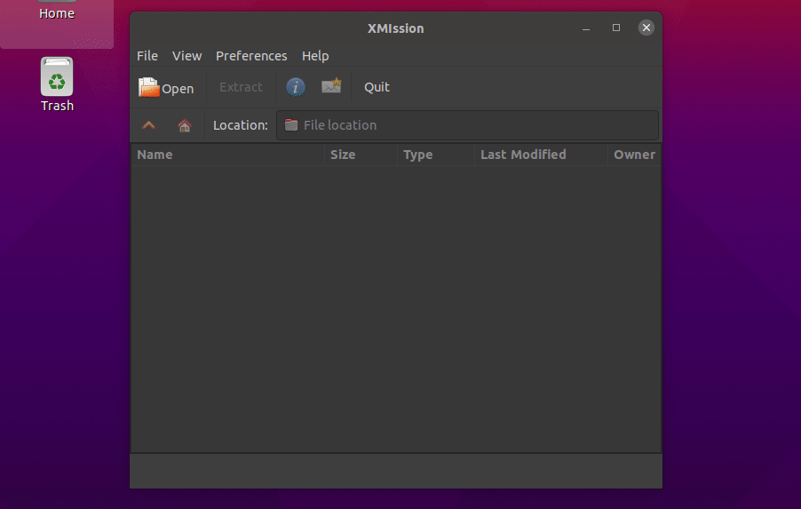
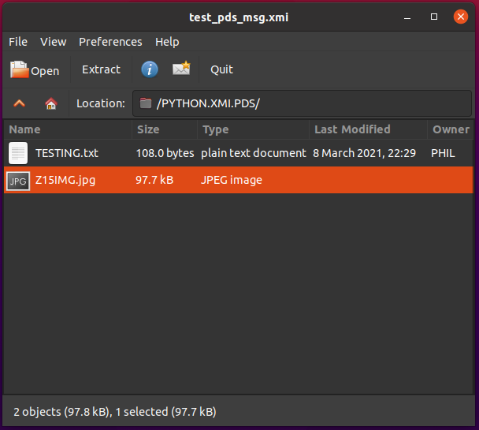
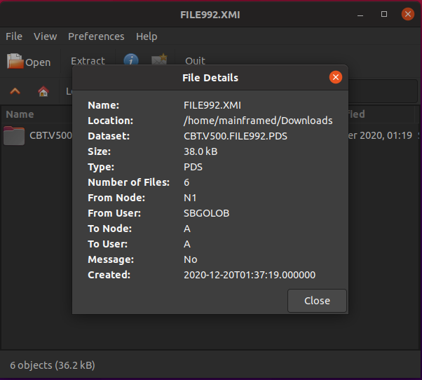
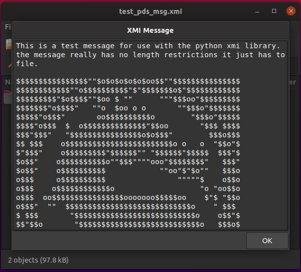
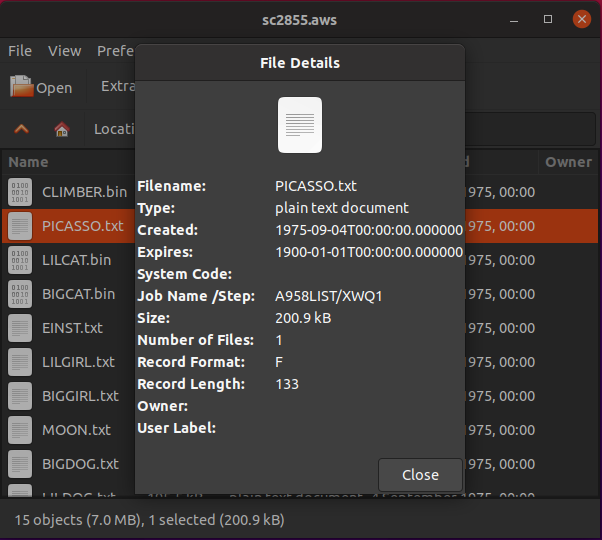
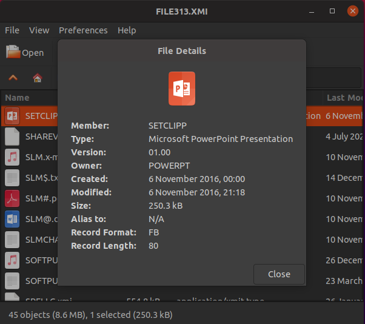

# XMIssion: XMI and Virtual Tape (AWS/HET) File Manager

## Examples

Open and extract (unload) XMI/AWS/HET mainframe files.





View xmi dataset information



Read XMI messages



View tape file information



View dataset member information



## Installation

You can install **XMIssion** from PyPI using:

```
python3 -m pip install xmission

```

or

```
python3 setup.py install --user
```

to install system wide:

```
sudo python3 setup.py install
```

## What is it?

XMIssion is a python GTK netdata (xmi) and virtual tape (aws/het) file manager.
This means you can open, browse, view information, and extract the contents of
xmi, aws and het files.

XMIssion is only a front end (a graphical interface) to the `xmi` python
library available here: https://github.com/mainframed/xmi.

## How to Use

Open XMIssion and select a file to open then browser and extract all, one or
many selected files. File information is available for the archive (XMI, AWS,
or HET file) and for each file in the archive.

XMIssion can also accept command line arguments. To view (lots) of debugging
information enable debug with `-d`. You can also pass the archive as a command
line argument.

Detailed help output:

```
usage: xmission.py [-h] [-d] [filename]

positional arguments:
  filename     xmi/het/aws to extract

optional arguments:
  -h, --help   show this help message and exit
  -d, --debug  Print debugging statements
```

## Uninstall

To uninstall:

```
python3 -m pip xmission uninstall
```

or

```
python3 setup.py uninstall --user
```

## More Information About XMI/AWS/HET

- [Project Repo](https://github.com/mainframed/xmission)
- [xmi python library](https://xmi.readthedocs.io/)
  - [XMI File format](https://xmi.readthedocs.io/en/latest/netdata.html)
  - [AWS/HET File format](https://xmi.readthedocs.io/en/latest/vitualtape.htm)
  - [IEBCOPY File format](https://xmi.readthedocs.io/en/latest/iebcopy.htm)
- [Issues](https://github.com/mainframed/xmission/issues)
- [Pull requests](https://github.com/mainframed/xmission/pulls)
